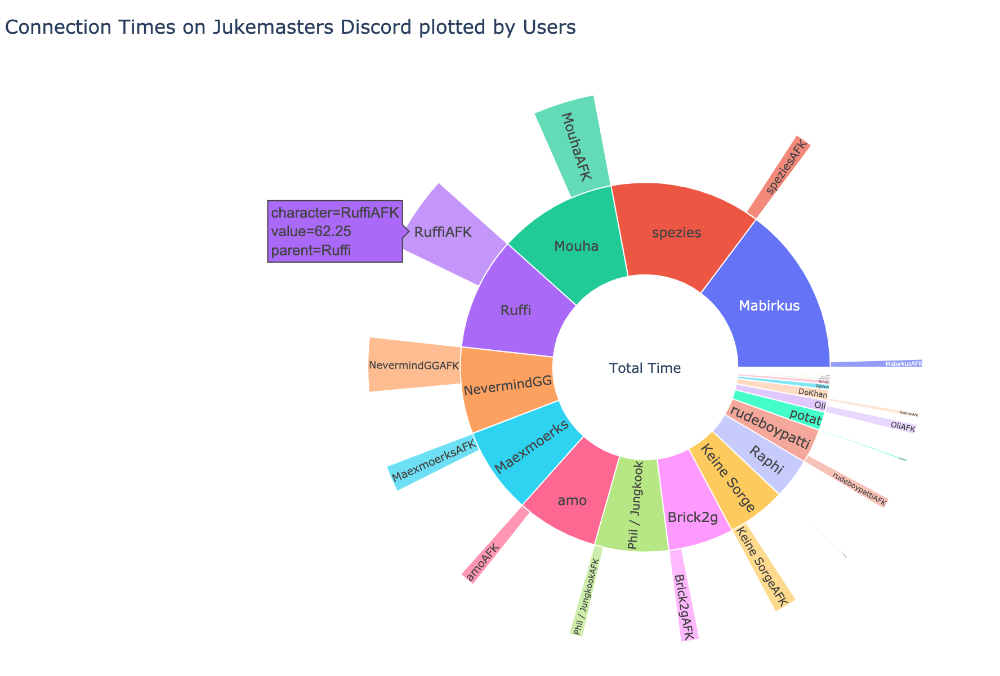

## discordInsights
A Discord Bot to track user activity on a server. 

##What can the collected data be used for?
This bot can be used for many data-related tasks such as:
<ul>
  <li>At which time do connect people most frequently</li>  
  <li>How much time do they spend on the server</li>
  <li>Are the connected people active while connected to a voice channel</li>
  <li>With whom are they talking the most</li>  
</ul>
Those results may help big servers to schedule their mods to be more active at a certain time to assist members in need.

##Sunburst Chart showing online to active ratio by user: 
 
